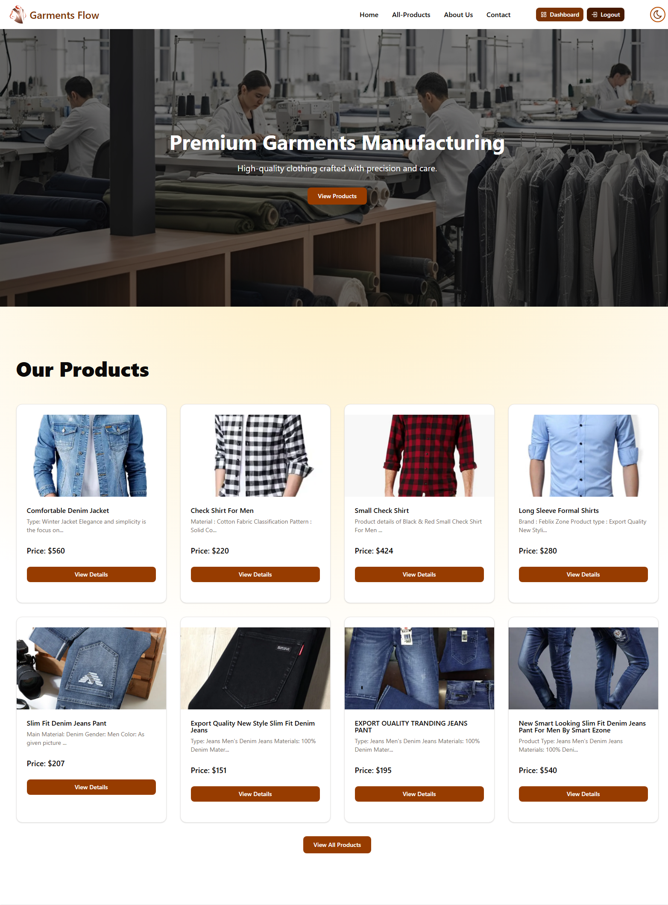

# Garments Flow – Client

This is the frontend client application for **Garments Flow**, a role-based
garment ordering and management platform. The client is built with modern React
tooling and communicates with a secure REST API to provide a responsive and
role-aware user experience for buyers, managers, and administrators.

### Home Page

### Dashboard View

---

## Live Application

https://garments-flow.vercel.app/

---

## Backend Repository

https://github.com/ashikurahman1/garments-flow

---

## Tech Stack

### Core

- React (Vite)
- React Router
- Tailwind CSS
- Shadcn UI

### State and Data Management

- TanStack React Query
- Axios

### Authentication

- Firebase Authentication

### UI and UX

- Framer Motion
- Swiper
- Recharts
- SweetAlert2
- Tabler Icons

### Forms and Utilities

- React Hook Form

---

## Key Features

### Authentication and Authorization

- Firebase-based authentication
- Secure token-based API requests
- Role-based access handling (buyer, manager, admin)

### Role-Based UI Rendering

- Conditional navigation links based on user role
- Protected routes to prevent unauthorized access
- Dynamic dashboards per user role

### Product Browsing

- Product listing with search and pagination
- Featured products on home page
- Product details view

### Order Management

- Place orders with quantity validation
- View order history
- Track order status using tracking ID

### Dashboards

Admin Dashboard:

- User management
- Product and order analytics
- Monthly order charts

Manager Dashboard:

- Manager-specific product listings
- Pending and approved orders

Buyer Dashboard:

- Order count
- Order history

---

## Important Learning

### Conditional Navigation Rendering

One of the major learnings in this project was rendering navigation links
conditionally based on authenticated user roles. This ensured:

- Clean user experience
- Improved security
- Clear separation of responsibilities across roles

### API Route Consistency

During development, a mismatch between frontend API calls and backend route
prefixes caused data fetching issues. This highlighted the importance of
maintaining consistent API endpoint structures across client and server.

---
